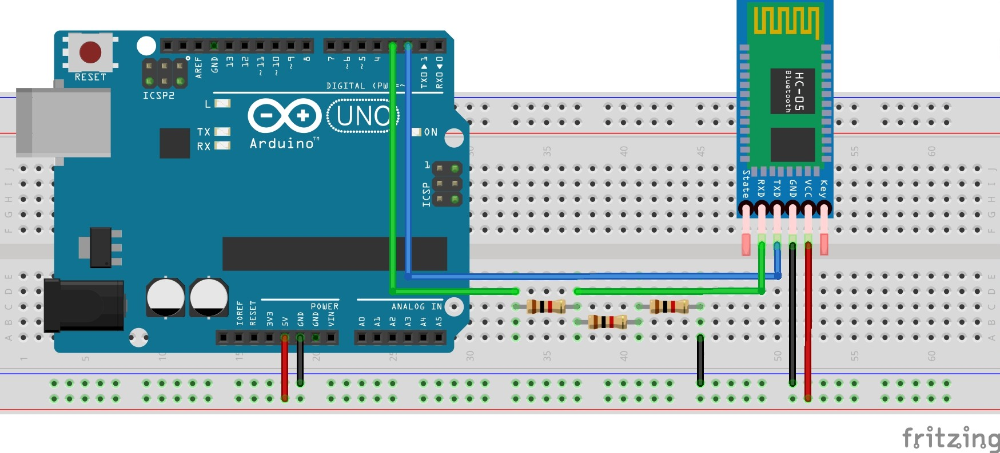

# HC-05 Configuration with Arduino
Follow the steps below in order to set the HC-05 module in AT command mode:

## Step 1
Connect the Arduino (without HC-05 module) to the computer and run empty code.

## Step 2
Disconnect the Arduino from the computer, wire the HC-05 module according the diagram below, then while pressing the 
button on the ZS-040 break-out board, connect the Arduino to the computer again. Now, The red LED on the ZS-040 break-out board must be 
blinking in 0.5Hz (one second on, one second off).

 
## Step 3
Run the sketch.

__Note.__ I've used `Clion` + `PlatformIO` as IDE. But using the official Arduino IDE would be ok as well.

Open the Arduino serial monitor, set baud rate to `38400` and choose `both NL & CR` for line ending. Type `AT`, then 
press enter. You should see `OK`.

Now, you can configure your HC-05 module with AT commands. :tada: